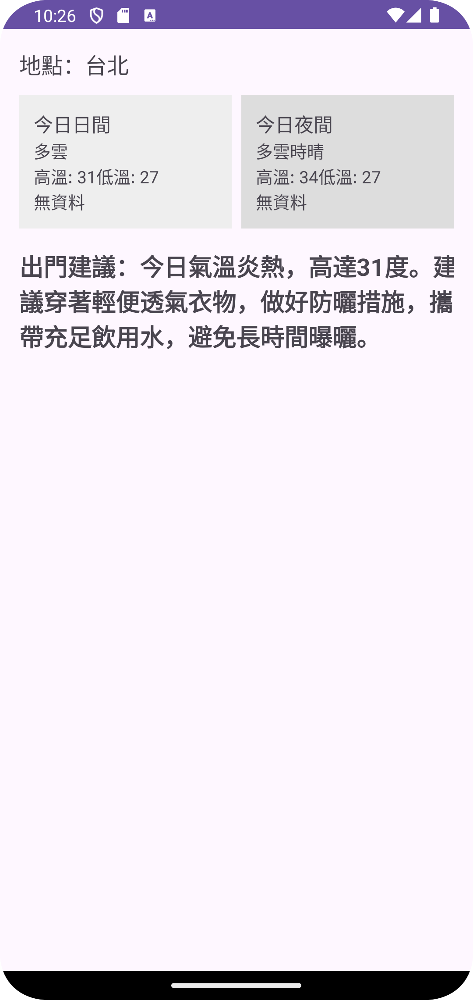

# 🌦️ Weather + AI Suggestion App

一個使用 **Java** 開發的 Android App，  
可以顯示中央氣象局的天氣資訊，並透過 AI (Gemini) 提供出門建議，例如是否需要雨傘、防曬或穿著建議。

---

## 📌 功能特色
- 顯示 **今日白天與夜晚** 的天氣資訊
- 取得 **天氣現象 (Wx)、降雨機率 (PoP)、最低溫 (MinT)、最高溫 (MaxT)**
- 串接 **Gemini API**，提供 AI 出門建議
- 支援 **Retrofit + OkHttp** 串接 API
- API Key 使用 **local.properties** 管理，避免外洩

---

## 🛠️ 技術棧
- **Java** (Android)
- **Retrofit2 / OkHttp3**
- **Gson**
- **Google Gemini API**
- **中央氣象局開放資料 API**

---

## 📂 專案結構
```app/
├─ java/com/example/weatherapp/
│ ├─ api/ # API 客戶端 (CWB, Gemini)
│ ├─ model/ # 資料模型 (CwbForecastResponse, AiResponse ...)
│ ├─ utils/ # 工具類別 (WeatherUtils)
│ └─ MainActivity.java # App 入口
├─ res/layout/ # XML 介面
└─ AndroidManifest.xml
```


